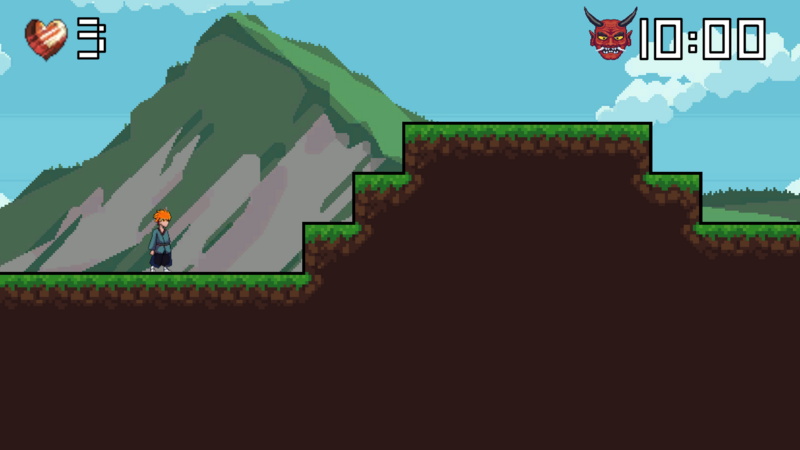
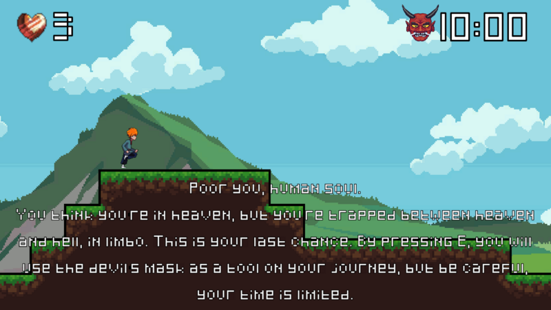
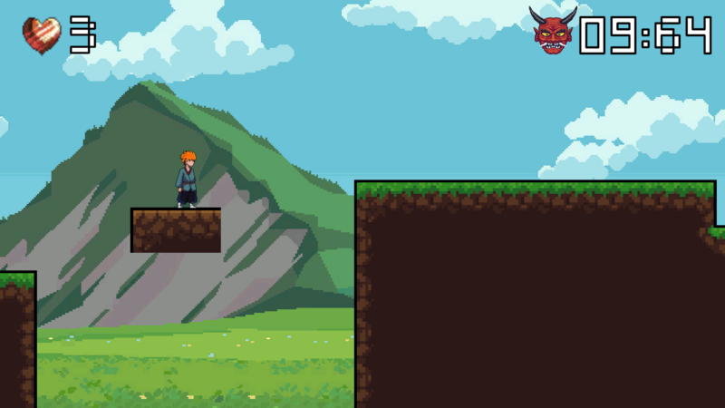
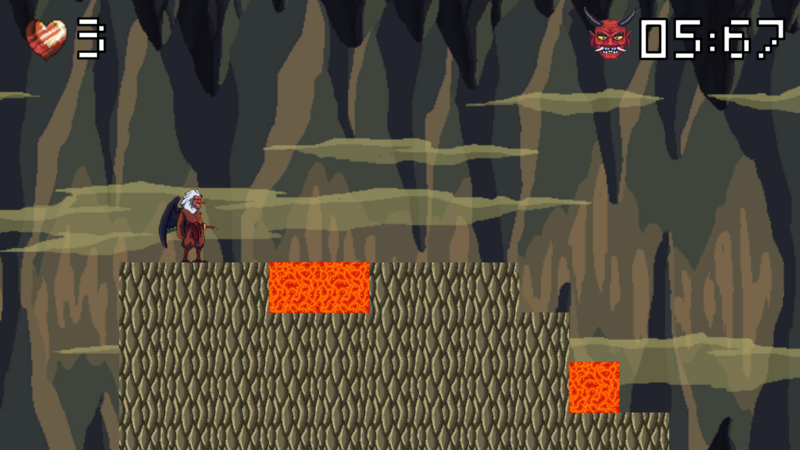

# Three Floors of Limbo

A 2D platformer made in **48 hours** for **Global Game Jam 2026** (theme: *Mask*).

You are a soul trapped in Limbo, climbing through three levels between Hell and Heaven. Reach paradise, or fall to damnation. Along the way you can activate a devil's mask for a limited time to help you survive.

🎮 [Play / download on the Global Game Jam site](https://globalgamejam.org/games/2026/3-floors-limbo-3) · ▶️ [Gameplay video](https://youtu.be/c4a90h881CM)

## Screenshots

  
  

  
  

## About

| | |
|---|---|
| **Jam** | Global Game Jam 2026 |
| **Theme** | Mask |
| **Engine** | Unity |
| **Platform** | Windows |
| **Team size** | 2 developers |
| **Time** | 1 weekend (48 hours) |

## Controls

| Action | Key |
|---|---|
| Move | `A` / `D` |
| Climb | `W` |
| Jump | `Space` |
| Activate mask | `E` |

You have three lives. Falling or dying too many times sends you back to the start of the run.

## Team

- [Elif](https://github.com/chibielif)
- [Kübra](https://github.com/kub-k)

## Credits & third-party assets

Built with original code, an original soundtrack, and pixel art from the following sources. Full thanks to their creators:

- **Music** — Original score by Onurhan Karabağ
- **Dungeon / platformer tileset** — [Free Dungeon Platformer Pixel Art Tileset](https://craftpix.net/) (CraftPix)
- **Forest biome** — 2D Pixel Art Platformer Biome (American Forest)
- **Shinobi & yokai character sprites** — CraftPix free character packs
- **UI** — DEVNIK 2D pixel buttons, Speech Bubble UI pack

All third-party assets are used under their respective free/CraftPix licenses (see the `License.txt` / `readme.txt` files bundled alongside each asset pack in `GGJ2026/Assets/`) and remain the property of their original creators. Code is original work by the team.

## Running it locally

1. Clone the repo.
2. Open the `GGJ2026` folder with Unity Hub (see `ProjectSettings/ProjectVersion.txt` for the exact editor version).
3. Open the `Scenes` folder and press Play, or build for Windows.
